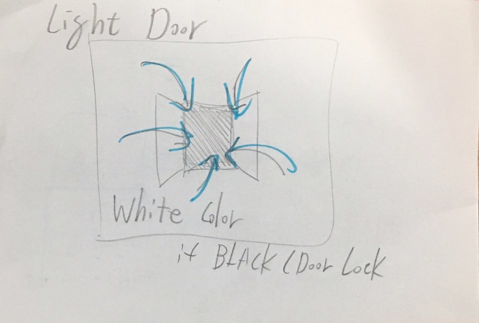

## 시작하기

접속 주소 : <https://dpolearts.github.io/PoeticCodeForNature/>

 * dpole

## 김홍주
 * 서울예대 재학 중 / 학번 1623002

## 작업
 * [최종 결과물](https://editor.p5js.org/undefined/sketches/bsBm8038q)
 * 여러 스케치 중 최종으로 낼 수 있는 작업물이 이거라서 제출합니다.
 * 위에 세 스케치를 구성하다가 최종적으로 새로운 스케치로 기말작업을 진행하게 되었다 이작업물은 인아웃이 주제이며 배경의 글리치와 대비되는 동글한 형체 시작과 동시에 모체로 모이며 배경의 글리치와 동그란 모체는 마우스의 입력값에 따라 변화되는 작업물로 입력되는 값과 결과값을 보여주는 작업이다

 
 

 * 자이로센서를 통해 음악의 비피엠과 스케일이 실시간으로 바뀌는 소프트웨어 모체가 기울기에 따라 움직여 부딪힌 것의 사운드를 낸다

 

 * 정확한 쉐잎이 없는 형체가 어느 구간을 지나가면 각자의 쉐잎을 랜덤하게 가지게 되고 어느구간을 다시 통과하면 글리치로 되돌아가 페이드아웃된다

 

 * 밖에 있는 흰색이 안으로 들어가면 겉이 검은색이되고 두색은 들어가고 생겨나듯 반복된다 마우스 움직임에 의해서

 
